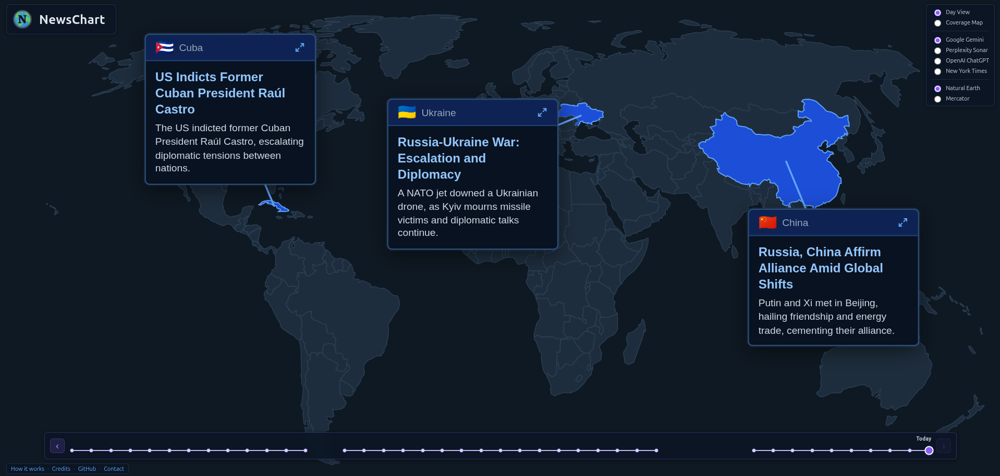
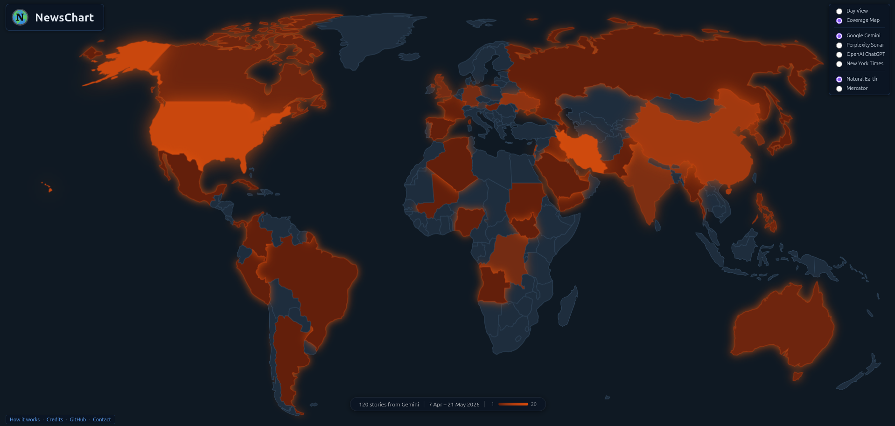
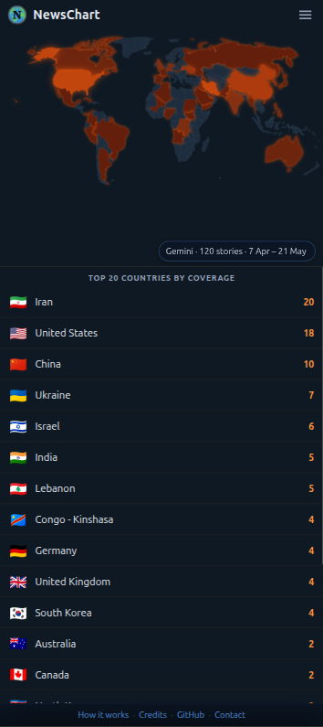
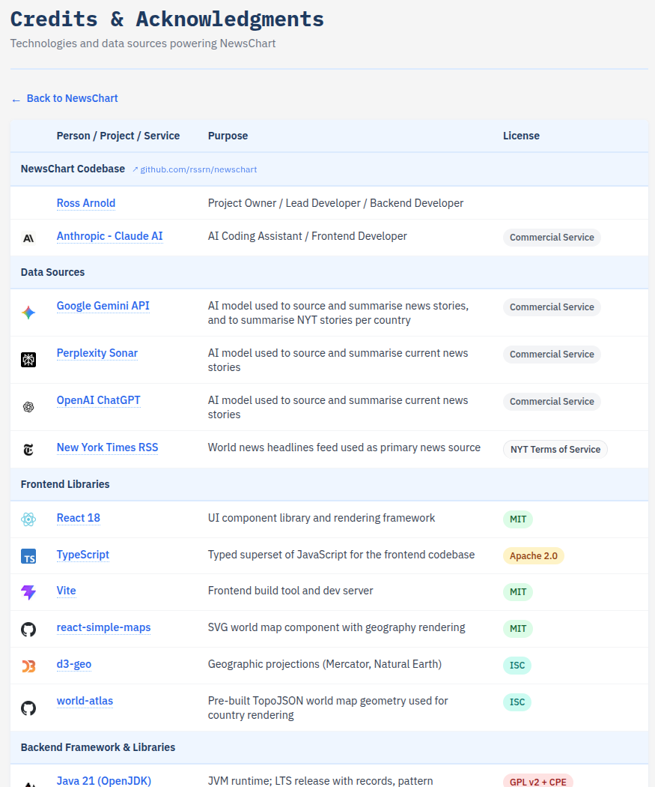

# NewsChart

> Top world news stories on an interactive world map — automatically ingested, AI-summarised, geo-tagged, and displayed as positioned callouts

**Live: [newschart.rossarnold.uk](https://newschart.rossarnold.uk/)**

[](https://github.com/rssrn/newschart/actions/workflows/backend-ci.yml)
[](https://github.com/rssrn/newschart/actions/workflows/frontend-ci.yml)


Each major AI model has quietly become a news editor - deciding, from everything happening in the world, which stories matter most right now. NewsChart makes that editorial judgement visible and comparable. Switch between Gemini, Perplexity, and ChatGPT to see which stories each AI is leading with, where in the world their attention is focused, and how their picks diverge. The New York Times provides a human editorial baseline for comparison.

The result is part news reader, part AI observatory: a way to watch - across different days and different models - whose version of the world you're being shown.

## Table of Contents
- [Screenshots](#screenshots)
- [Technical highlights](#technical-highlights)
- [Quick Start](#quick-start)
- [Architecture](#architecture)
- [Development](#development)
- [Build](#build)
- [Monitoring (optional)](#monitoring-optional)
- [Deployment](#deployment)
- [Credits](#credits)
- [License](#license)

**Features:**
- Daily news from four sources: Gemini, Perplexity, ChatGPT, and NYT RSS
- AI-powered summarisation and geo-tagging via Google Gemini and OpenRouter models
- Interactive Mercator / Natural Earth world map with up to 3 story callouts
- Time travel — browse historical news by date (desktop slider or mobile chip strip)
- Callout layout algorithm that minimises overlaps and connector crossings (based on PFLP literature)
- Dark map theme with frosted-glass callout boxes
- Keyboard navigation (left/right arrow keys on timeline)
- Observability: Prometheus metrics, Grafana dashboards

**[How it works: AI models, prompts, and engineering →](https://newschart.rossarnold.uk/method)**

## Screenshots

| Desktop — day view | Desktop — heatmap |
|---|---|
|  |  |

| Mobile — heatmap | Desktop — credits |
|---|---|
|  |  |

## Technical highlights

- **Multi-model AI comparison** — three independent LLMs (each with native web search) plus a human-edited NYT baseline, queried daily via the same prompt so differences in coverage are the models' own.
- **Typed AI output** — Spring AI's structured-output binding maps model responses directly to `NewsHighlight` Java records; no free-form text parsing anywhere in the pipeline.
- **Full-stack type safety** — Java 21 records on the backend, TypeScript on the frontend, shared schema via REST contract.
- **Production-grade CI/CD** — split backend/frontend pipelines, Testcontainers integration tests against real MongoDB, OWASP Dependency-Check + Sonatype OSS Index + Dependabot across Maven/npm/Actions, tag-triggered deploys via Tailscale.
- **PFLP callout layout algorithm** — exhaustive candidate enumeration (16 directions × 6 distances per callout) with penalty scoring for overlaps, connector crossings, connectors passing through boxes, and viewport violations. Based on [Christensen, Marks & Shieber (1995)](https://doi.org/10.1145/212332.212334); feasible because N ≤ 3.

## Quick Start

### Prerequisites

- Java 21+
- Node.js 20+ and npm
- MongoDB (via Docker Compose, or a local install)
- Google Gemini API key (for AI summarisation)
- OpenRouter API key (optional, for Perplexity/OpenAI sources)

### 1. Install git hooks

```bash
./setup.sh
```

This configures pre-push checks (security audit + accessibility tests) that mirror CI.

### 2. Start MongoDB

```bash
docker compose up -d mongodb
```

### 3. Start the backend

```bash
export GOOGLE_API_KEY=your_gemini_key
export OPENROUTER_API_KEY=your_openrouter_key   # optional, for Perplexity/OpenAI
./mvnw spring-boot:run
```

The backend starts on port 8080 and begins ingesting news on a schedule.

### 4. Start the frontend

```bash
cd frontend
npm install
npm start    # dev server on :3000, proxies API calls to :8080
```

Open [http://localhost:3000](http://localhost:3000).

---

## Architecture

NewsChart is a full-stack application with a Java Spring Boot backend and React frontend.

### Data Flow

```
Scheduler → Pipeline Orchestrator → News Source
    → parse / summarise / geo-tag via AI
    → MongoDB (Callout)
    → REST API (/api/news/calloutsForDay/{date})
    → React frontend
    → PFLP callout layout algorithm
    → Interactive world map
```

### Backend (`src/`)

| Package | Description |
|---|---|
| `api/` | REST controllers — `GET /api/news/calloutsForDay/{date}`, `GET /api/news/availableDays` |
| `news/source/` | NYT RSS ingestion and parsing |
| `news/highlights/` | Processed highlights — `NewsHighlights`, `CalloutBuilderService` |
| `news/pipeline/` | Modular pipeline: `BasePipelineOrchestrator`, NYT, Gemini, OpenRouter variants |
| `callout/` | `Callout` entity, repository, service, source/type enums |
| `scheduler/` | Background fetch scheduling |
| `ai/` | `GeminiGatewayService`, `OpenRouterGatewayService`, `AiPrompts` |
| `geo/` | `Country` entity and `CountryFactory` |

**Pipeline sources:**

| Source | Model | Notes |
|---|---|---|
| Gemini | `gemini-2.5-flash` | Google Search grounding enabled |
| Perplexity | `perplexity/sonar-pro-search` | Via OpenRouter, native web search |
| OpenAI | `openai/gpt-4o-search-preview` | Via OpenRouter, native web search |
| NYT RSS | `gemini-2.5-flash-lite` (2.5, geo-tag only) | Human-curated feed; Gemini summarises and geo-tags, search grounding off |

### Frontend (`frontend/src/`)

| File | Description |
|---|---|
| `MapChart.tsx` | Main map component (Mercator projection via react-simple-maps) |
| `StoryCalloutList.tsx` | Renders callout boxes with SVG connectors to country markers |
| `DateTimeline.tsx` | Date navigation (desktop slider + mobile chip strip) |
| `utils/mapCalloutUtils.ts` | Exhaustive PFLP-based callout layout algorithm |

**Layout algorithm:** Generates up to ~96 candidate positions per callout (16 directions × 6 distances), evaluates all combinations for up to N=3 callouts, and selects the lowest-penalty layout. Penalises overlaps, viewport violations, connector crossings, connectors passing through boxes, and connector length.

### Storage

MongoDB stores two collections:
- `news_rss` — raw RSS/AI news items
- `news_highlights` — processed, summarised, geo-tagged highlights (source of callouts)

---

## Development

### Backend tests

```bash
./mvnw test
./mvnw test -Dtest=ClassName#methodName
```

Uses Testcontainers (MongoDB) for integration tests — requires Docker.

### Frontend tests

```bash
cd frontend
CI=true npm test         # unit tests (React Testing Library + vitest-axe component a11y)
```

#### Accessibility tests

WCAG 2.1 AA audits using Playwright + axe-core, run against a production build (no backend required — API calls are stubbed). Covers the main map (day view, heatmap, modals, mobile sheet) and the `/method` and `/credits` pages, across desktop and mobile viewports.

```bash
cd frontend
npm run test:a11y
```

#### Layout algorithm test suite

The callout layout algorithm has its own headless test harness that runs each fixture across 9 viewports × 2 projections and checks hard geometric constraints (no box overlap, no out-of-bounds, no connector crossings or connector-through-box, no obscured origins).

```bash
# Run all fixtures, print pass/fail summary, write test-output/layout-report.json
node scripts/run-layout-tests.mjs

# Filter by fixture id, tag, or group
node scripts/run-layout-tests.mjs --id handcrafted-wide-aus-bra-can
node scripts/run-layout-tests.mjs --tag needs-fix
node scripts/run-layout-tests.mjs --group handcrafted

# Single viewport or projection
node scripts/run-layout-tests.mjs --viewport laptop-1366-typ --projection mercator

# Capture screenshots (builds frontend, starts vite preview, saves PNGs)
node scripts/run-layout-tests.mjs --screenshots
node scripts/run-layout-tests.mjs --tag needs-fix --screenshots
```

Screenshots land in `frontend/test-output/screenshots/` (gitignored). Filename convention: `{id}__{projection}__{viewport}.png`.

**Fixture corpus** — `frontend/src/__tests__/layout/fixtures/`

- `handcrafted-*.json` — hand-authored cases (committed, run in CI via `npm test`)
- `live-*.json` — captured from the production API via `scripts/export-callouts.mjs` (committed once they're interesting, then treated identically to handcrafted)

**Tag conventions**

| Tag | Meaning |
|---|---|
| `needs-fix` | Known algorithm failure — skipped in CI so the build stays green; kept as a regression target |
| `sample` | Transcription of an in-app `?testCase=N` scenario |
| `tight-cluster` | Origins are very close together on the map |
| `vertical-stack` | Origins share similar longitudes, stacked vertically |
| `wide-spread` | Origins are widely separated — expected to always pass |

**Adding a live fixture from the API**

```bash
# Fetch from production (writes live-<date>-<provider>.json if ≥3 callouts)
node scripts/export-callouts.mjs \
  --base-url https://newschart.rossarnold.uk \
  --providers GOOGLE_GEMINI \
  --date 2026-05-10

# Date range, multiple providers
node scripts/export-callouts.mjs \
  --base-url https://newschart.rossarnold.uk \
  --providers NEW_YORK_TIMES,GOOGLE_GEMINI \
  --from 2026-05-01 --to 2026-05-10

# --force overwrites an existing fixture (use carefully — preserves no hand-edits)
```

Eyeball the result, add tags/notes in the JSON, then commit. Re-running without `--force` will never clobber a committed fixture.

### Build

```bash
# Frontend production build
cd frontend && npm run build

# Backend fat jar (bundles built frontend from frontend/build/)
./mvnw package
```

### Monitoring (optional)

```bash
docker compose --profile monitoring up -d
```

Starts Prometheus (`:9091`), Grafana (`:3001`), Node Exporter, and a Grafana dashboard watcher that syncs changes back to the repo. Dashboards are in `grafana/dashboards/`.

---

## Deployment

Deployment is triggered automatically by pushing a `v*` tag, or manually via GitHub Actions `workflow_dispatch`.

**Pipeline:**
1. Build frontend (`npm run build`)
2. Set Maven version from the git tag
3. Build backend fat jar (`./mvnw package -DskipTests`)
4. Connect to production host via Tailscale
5. `rsync` jar and frontend build to production server
6. `systemctl restart newschart`

See `.github/workflows/deploy-to-live.yml` for details.

---

## Credits

Built with:
- [Spring Boot 4](https://spring.io/projects/spring-boot) — backend framework
- [Google Gemini API](https://ai.google.dev/) — AI summarisation and geo-tagging
- [OpenRouter](https://openrouter.ai/) — multi-model AI gateway (Perplexity, OpenAI, etc.)
- [React 18](https://react.dev/) — frontend framework
- [react-simple-maps](https://github.com/zcreativelabs/react-simple-maps) — world map component
- [world-atlas](https://github.com/topojson/world-atlas) — TopoJSON world geometry
- [MongoDB](https://www.mongodb.com/) — news storage
- [Testcontainers](https://testcontainers.com/) — integration test infrastructure

[See full credits and licenses →](https://newschart.rossarnold.uk/credits)

---

## License

GPL-3.0-or-later — see [LICENSE](LICENSE) for details.
